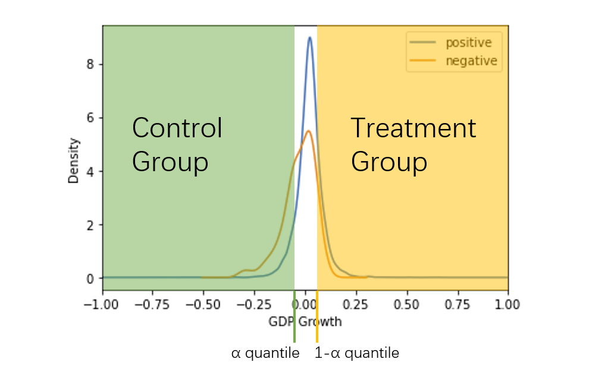
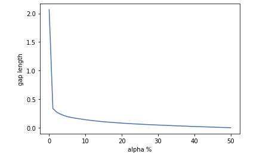
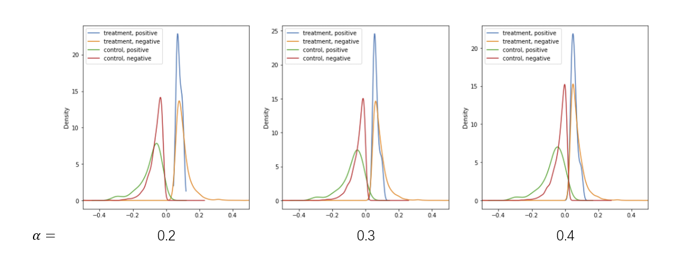
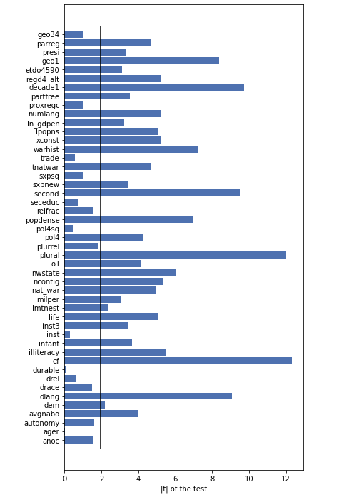
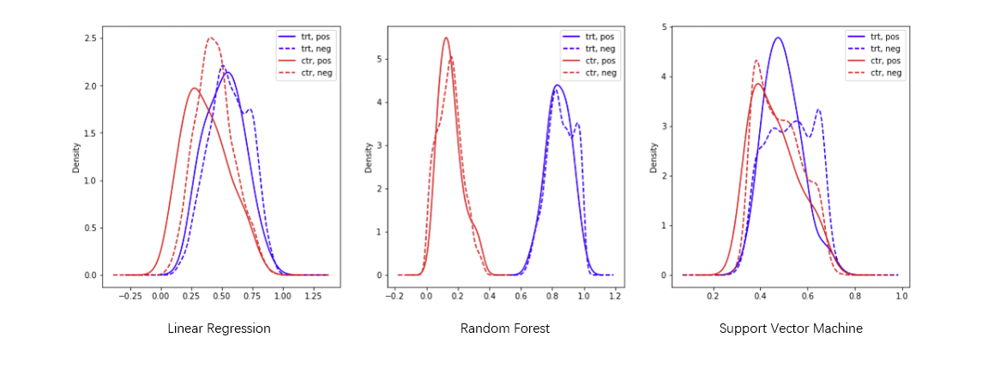
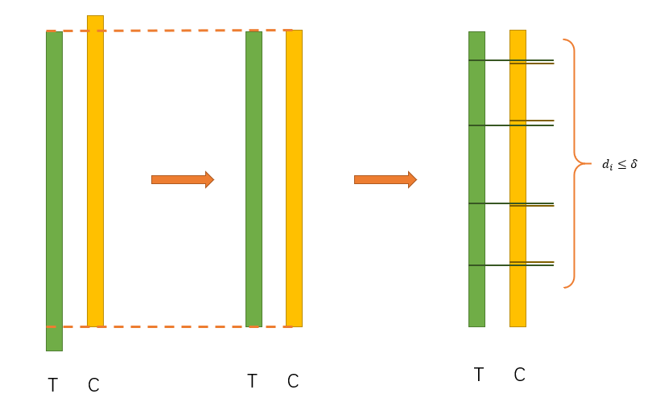
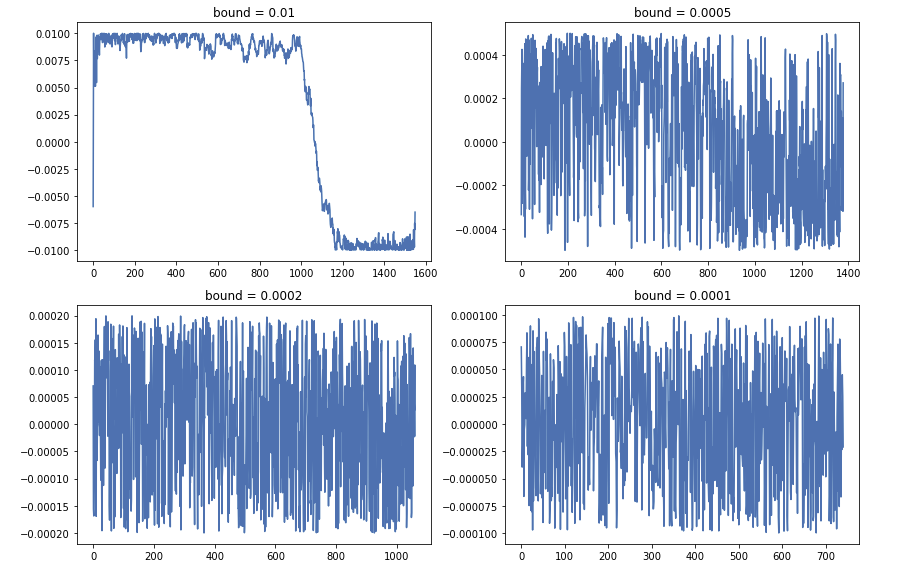
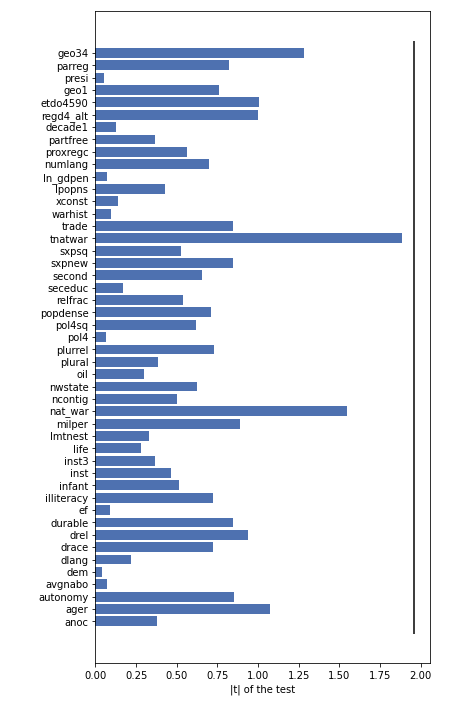
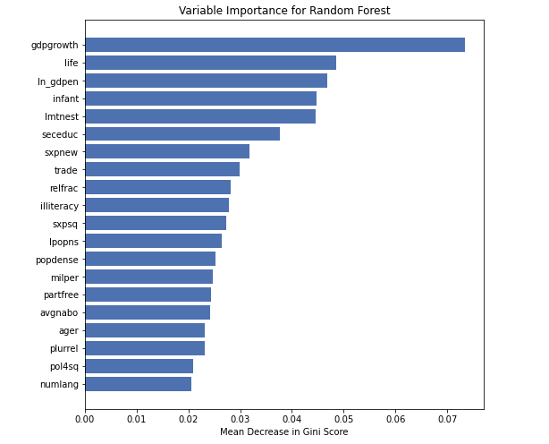

# Improving the performance and explainability of civil war onset predictive models

## 1. Introduction
This project is based on the article "Comparing Random Forest with Logistic Regression for Predicting Class-Imbalanced Civil War Onset Data" by Muchlinski, Siroky, He and Kocher. This article proposes to use a Random Forest classification model in order to predict Ciwil war onset. This method would be a more efficient alternative to the logistic regression methods that are commonly used in the field for such purpose. 

In this project we extend the the purpose of the paper on civil war onset. First, we want to analyse an alternative approach for predicting civil war onset that could potentially predict the performance of the model.  This approach is based on Neural networks.

Secondly, our aim is to investigate the interrelation that exists between civil war and economic growth. First, we will establish a model to infer the causal effect of gdp growth on civil war onset. Finally, we will show how the occurrence of a civil war affects the local growth after the end of the war.

These question broaden the scope of the paper and complement it.

### 2. Improving the Performance

The challenge of working with imbalanced datasets is that most machine learning techniques will ignore, and in turn have poor performance on, the minority class, although typically it is performance on the minority class that is most important. In our case, having civil, i.e. $y=1$, is the minority class, and it is more important to predict civil war onset correctly when there is going to be one. 

In this project, we attempted three approaches, one is Synthetic Minority Over-sampling Technique (SMOTE) combined with random forest, the other is fully connected neural networks. We also applied random forest algorithm as our base line as in the civil war paper, random forest has the best performance. We experimented with each approach on both `90 variables` (the variables used in the paper) and `285 varialbes` (all varialbes included).

#### 2.1

Because we are essentially addressing a binary classification problem on imbalanced dataset, we compare all these approaches using receiver operating characteristic (ROC) curves and areas under the curves (AUC) as our evaluation metric. For neural networks, given the computational resouces available, we perform 5-fold stratified cross validation. For all other methods, we perform 10-fold stratified cross validation. We use stratified version because our dataset is highly imbalanced and we want to make sure each fold have the simialr class distribution as the entire dataset.

#### 2.2 Synthetic Minority Over-sampling Technique
One approach to addressing imbalanced datasets is to oversample the minority class. One idea is that new examples can be synthesized from the existing examples. This is a type of data augmentation for the minority class and is referred to as the Synthetic Minority Oversampling Technique, or SMOTE for short. The performance of SMOTE combined with random forest is shown in section 2.5.

#### 2.3 Neural Networks
Being one of the most flashy algorithms of all time, we believe it will be worth trying out neural networks. But although spend a long time trying to get them work and improve them, they seem to have very poor performance against our very imbalanced dataset.

##### Architecture

We implemented two neural networks (NN) with similar architectures, with one takes in 90 variables and the other takes in 284 variables. The above image illustrates the architecture of the NN with 90 input variables. It has two hidden layers with relu functions as activati on functions. The final activation function is a logit function so that the NN outputs the probability of `y=1`. We also applied `dropout` and `batchnorm`. We applied `dropout` hoping that it will regularize the NNs and prevent them from overfitting. We applied `batchnorm` to make artificial neural networks faster and more stable through normalization of the input layer by re-centering and re-scaling.

##### Training
We used the Adam optimization algorithm to train our deepnet. We plotted the loss vs. epoch curve. We can see that the loss is flatten at the end of training. The accuracy oscillates around 98.3%. Because the loss and accuracy have stopped getting better, we believe the training has completed. Note that because we have extremly imbalanced class distribution, the 98.3% accuracy doesn't mean anything. (We can achieve 98% accuracy by simply guessing no war all the time). The loss and accuracy plots are for telling us when to finish training only.

loss/accuracy vs. number of epoch (NN with 90 variables as input)


loss/accuracy vs. number of epoch (NN with 285 variables as input)


##### Terrible Performance of NN
It turned out that although being some of the most flashy classification algorithms, neural networks (NNs) perform really poorly on our very imbalanced dataset. We believe this might be because the data examples for no war are too many and they provide the NNs with very strong signal, where as the data examples for wars provide very weak signal. So the NNs are overfitted to the "no war" examples and have not learned much from the "war" examples. 


 

#### 2.4 SVM
We also applied Support Vector Machine, a classic classification algorithm. We applied the normalization first and then feed the normalized data to the SVM model. The performance of SVM is shown in section 2.5.

#### 2.5 Compare all models
Now we compare all models. The number 285/90 denotes the number of explanotory variables. We can see that neural networks have the worst performance where as random forest with or without SMOTE have the best performance. SVMs have good results but not as good as random forests with or without SMOTE. For all methods except neural networks, including all the variables help improving the performance by quite a bit.


## 3. Causal Inference of the GDP related features

### 3.1 Background

In the civil war paper, it says that:

> Since Random Forests does cross-validation internally through the use of OOB observations, we can use these OOB observations to determine some aspects of causality.
>
> ...
>
> Figure 4 shows the mean decrease in a measure of predictive accuracy, called the Gini Score, for the top twenty variables that Random Forests picked.
>
> ...
>
> Variables with a greater mean decrease in the Gini Score more accurately predict the true class of observation i when i is OOB.
>
> ...
>
> The best predictor of civil war onset is national poverty as measured by both the growth rate of national gross domestic product (GDP) and GDP per capita. This reinforces the results of nearly every examination into the causes of civil war onset published in the past decade.


However, it must be very cautious while talking about the causality. In most of statistic models, it can only get the result of correlation, but not the causality.  So when we see that the authors of the paper use Random Forest model to get "some aspects of causality", we are worried about the result, because the Random Forest model seems not have ability to do the causal inference. Although the model have the OOB observations to do the evaluation and comparison, but the comparison is based on a very imbalance dataset. That means the comparison can't get the result of causality.

In our work, we will do the causal inference to learn if the value of GDP growth can really lead to civil war onset by using the same dataset and features as the Random Forest model.  


### 3.2 Causality

One of the most widely used model of causal inference is the Neyman-Rubin model.  In a basic Neyman-Rubin model, if we want to know the causal effect of a feature T, we will assign the samples into two groups based on the value of T: 

* Treatment group: T = 1
* Control group: T = 0

Then, the potential output of the two groups, Y|T=1 and Y|T=0 can be compared and show the causal effect of feature T:


However, this idea is based on a assumption that the other features of the Treatment group and Control group are similar, they only have difference in the feature T. It's very difficult to hold this assumption for the observation data because we can't determine the distribution of the covariates by randomization.  So if it's possible to use this causality model even in the observation study?

The answer is yes. What we need is the tool called propensity scores. A propensity score is the conditional probability that a subject receives “treatment” given the subject’s observed covariates:


The goal of propensity scoring is to  balance observed covariates between subjects in control and treatment study groups. The researchers have proven that when the propensity score is balanced in the treatment and control group, we can get the causal effect of feature T properly. So we will start with find a good propensity scores and balance the propensity scores of the two groups.

After we get the propensity scores, we can then do the "Propensity Score Matching". By doing this, each pair of samples has similar Propensity Scores so we can compare their outputs. 

Our architecture to do the causal inference is:


### 3.3 Treatment

Because we want to get the causal effect of feature GDP Growth, we must find a good way to assign the samples into the Treatment Group and Control Group. If the Treatment T is a binary value, the samples can be divided based on the binary value of T. However, the GDP Growth is continuous  float numbers, and the continues treatment problem is much more complex than the binary case. So our basic idea is to discretize the GDP Growth:



We divide the samples into three parts based on the quantile of the GDP Growth. In order to make sure the GDP Growth of the Treatment Group and Control Group have a "gap", we choose to drop the "middle" samples.



When the alpha is too big, the difference between the Treatment Group and Control Group will close to 0 and there is no gap between them. However when the alpha is too small, we the sample size of each group will be small, and we can only use a little part of the dataset.



After tuning the alpha,  we choose to let alpha=0.3 and we can use 60% of the samples.

What's more, from the density plot, we can see that the positive and negative samples has the similar distributions in each group.


### 3.4 Covariates

Based on the Random Forest Model, we can select some features as covariates. Now let's show that these covariates are imbalanced in Treatment and Control Group, by using the t-test of the mean of two independent samples:



Most of the features are imbalanced in the Treatment Group and Control Group. So it's essential to use a propensity scores to balance the samples.


### 3.5 Propensity score

We train a model to predict if the sample is in the treatment group by using the the covariates. The probability of the prediction can be regard as the  propensity score. We try three different models to get the propensity score.



Based on the result above, we choose to use the Logistic Regression model to generate the propensity score. Then we can do the matching.


### 3.6 Matching

We can match the samples by using a greedy algorithm:



1. Drop some samples to make sure the two groups have the same range of propensity score.

2. t = min_propensity_score(Treatment), the sample is s_t

   c = min_propensity_score(Control), the sample is s_c

3. Compare t and c:
   1. t - c > delta: drop s_c
   2. t - c < -delta: drop s_t
   3. otherwise: match (s_c, s_t) and drop them
4. If there is no sample in Treatment Group or Control Group, return all the matches. Otherwise go back to step 2

 By running this algorithm, we can get the differences of the propensity scores in each pair:



We can find when the bound become smaller, the number of pairs becomes smaller. But when the bound become bigger, the quality of matches become worse. Finally we choose bound = 0.0002.

After the matching, we can test the balance of the covariates again and get the result:



That means all covariates are balanced.


### 3.7 Mean causal effect

Compute the mean causal effect:


So our result shows that there is no significant causal effect.


### 3.8 Train Random Forest model with the matching data

Finally, we choose to train a Random Forest model by using the matching data only. The importance of the features is:



That means even the gdpgrowth have no significant causal effect, it's still the most important feature.


### 3.9 Conclusion

Although some new machine learning models can achieve very good performance in prediction, it doesn't mean that these models can do everything. In this paper, we can get some useful information from the feature importance. However, the causality should not be included into it. 

The causality in statistics is a very serious topic, because it can lead to so much misunderstanding. But it doesn't means that the causality should not be in our consideration. Causal inference is still a very popular topic, and there are some very intesting findings in this topic.  

Actually, our result is not very exact. Because the dataset is so imbalanced. And over 98% of the samples are negative. That means the basic method of causal inference may have bad performance in verify causality of rare events. 


## 4. Analyzing the impact of civil war on GDP growth

### 4.1 Background
Now that we have analyzed the impact that GDP growth has on civil war onset, we now invert the question. At this point, we want to understand how the growth rate of a country changes after a civil war with respect to how it was before the war. 

In order to do so, we utilize some regression methods that can estimate the effect of civil war on GDp.

### 4.2 Linear Regression to obtain the effect of the civil war

#### 4.2.1 Data Processing
We processed the dataset in a way such that we had two entry for each civil war, one before the civil war and one after. We computed the average growth in the 5 years immediately before the war, and in the 5 years immediately after. We also included several other variable which could potentially cause disturbance in the data being correlated with the residuals, such as the year, the duration of the war, the geographical region and the number of wars experienced by a country.

#### 4.2.2 GLS Regression

After having a ready dataset, we carried a linear regression with the following variables:

```avg_growth ~ post_war,war_length, avg_neigh_gdp, num_wars,geo2,geo8,geo34,geo57,geo69```

In order to carry the regression, we used GLS estimators, as they account for correlation of residuals, which is quite probable in our problem. Before the experiment, we determine that we consider the critical value $\alpha$ to be $\alpha = 0.05$, meaning that we will consider as statistically significative all coefficients with an associated p-value $p<0.05$

The results of these regression show that the GLS estimator for the coefficient of the variable `post_war` is 0.0162, with a standar error of 0.027. This means that the the p-value associated to the variable indicating whether we are in a period before or after a war is 0.047. This value is below the critical value of $\alpha = 0.05$, thus we accept the result, which implies that the coefficient of the variable `post_war` is statistically significative. This, in turn means that the GDP growth in the five years after the end of a civil wear tends to be higher by 1.62% than in the 5 years before the civil war.  
This result can be explained by the fact that during the civil war, a great destruction and reduction in GDP is generally experienced by country. Hence, the post-war usually sees a reconstruction effort which implies a high GDP growth rate, as the country has to reach back its original level of income. 

### 4.3 Panel Data Methods
In order to verify whether the presence of a civil war caused any other variable to have an effect on  had an effect due to the war, we applied a panel data method using Fixed Effects and Random Effects. In both cases we considered two periods, one before a civil war and the other after a civil war. We made a regression of the growth rate over the other variables (in this case, clearly, the civil war was a time index an not a variable).

In both cases, it resulted that all coefficients were not statistically significant in the FE and RE model, which means that a change in the GDP growth after the war is not caused by any of the variables included in our model. This results corroborates part 4.2, hinting that an increase GDP growth is directly cause by the destruction brought by the civil war.
